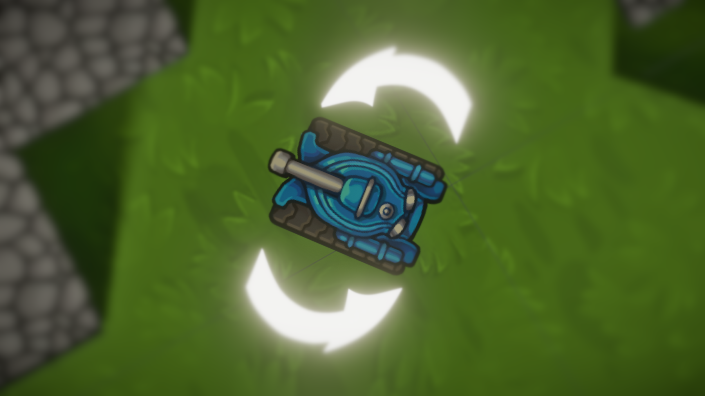

# lua-tank-game
*an infinite, wave-based PvE game with tanks. written in LÖVE.*

---

# inspirace
- hra je lehce inspirována hrou 2, 3, 4 player games.

---

# procedurální mapa

- barva mapy se mění podle perlin noisu.
- na náhodných místech se generují struktury:

---

# tanky

- všechny tanky mají nějaký počet nábojů a životů...

---

### ...můžou se pohybovat dopředu a dozadu...

---

<h3 style="text-align: right">...otáčet se doprava a doleva...</h3>

---

# <h2 style="text-align: center">...a střílet.</h2>

---

# game loop

- spawnují se vlny nepřátel. po každé vlně se začne další, ve které je o něco víc nepřátel.
 
- nepřítelé mají každou vlnu lepší a lepší tanky.
 
- když hráč zabije nějakého nepřátele, dostane bonusy ve formě nábojů, životů, atd

---

# nepřátelské AI

- nepřátelské tanky vypočítávají cestu k hráči pomocí **A*** pathfinding algoritmu.
 
- pokud hráč není ve viditelnosti, nepřátelský tank se snaží najít nejbližší bod, kde hráč je vidět.
 
- když je hráč dostatečně blízko, nepřátelský tank začne střílet.

---

---

<h1 style="text-align: center">demo</h1>

<iframe style="border-radius: 10px; border: none; width: 800px; height: 450px; display: block; margin-left: auto; margin-right: auto" src="http://localhost:8081/video_feed">

</iframe>

---

<h2 style="text-align: center; text-shadow: 0px 0px 1px white;">děkuji za pozornost.</h2>

---

  

    <h1><b>instalace</b></h1>
    - všechen kód i tato prezentace je open-source.
      
    - na githubu jsou předkompilované soubory pro Windows, MacOS a Linux.
  

  

    <code style="font-size: 0.92rem">git clone https://github.com/robinafro/lua-tank-game.git</code>
        
  

